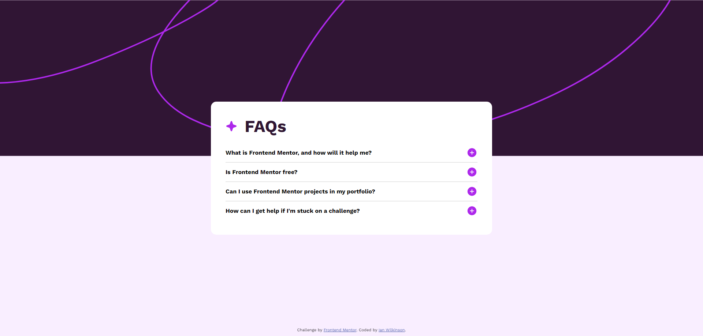
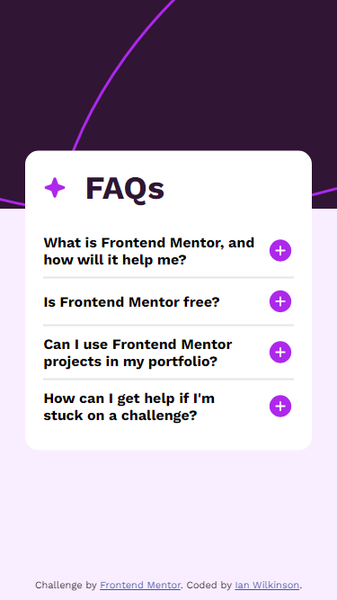

# Frontend Mentor - FAQ accordion solution

This is a solution to the [FAQ accordion challenge on Frontend Mentor](https://www.frontendmentor.io/challenges/faq-accordion-wyfFdeBwBz). Frontend Mentor challenges help you improve your coding skills by building realistic projects. 

## Table of contents

- [Overview](#overview)
  - [The challenge](#the-challenge)
  - [Screenshot](#screenshot)
  - [Links](#links)
- [My process](#my-process)
  - [Built with](#built-with)
  - [What I learned](#what-i-learned)
  - [Continued development](#continued-development)
  - [Useful resources](#useful-resources)
- [Author](#author)


## Overview

### The challenge

Users should be able to:

- Hide/Show the answer to a question when the question is clicked
- Navigate the questions and hide/show answers using keyboard navigation alone
- View the optimal layout for the interface depending on their device's screen size
- See hover and focus states for all interactive elements on the page

### Screenshots

Desktop



Mobile




### Links

- [Live Site URL](https://faq-accordion-ianwilk20.netlify.app/design/index.html)

## My process

### Built with

- Semantic HTML5 markup
- CSS
- Flexbox
- JavaScript

### What I learned

Non-desktop device support:
- Viewport meta tag
  - The browser's "viewport" is the visible area of a webpage within the window, often different from the page's actual size, requiring scrollbars for navigation. On mobile devices, pages may be rendered in a wider virtual viewport and then scaled down to fit the screen, allowing users to zoom and pan. This accommodates non-mobile-optimized sites but can limit the effectiveness of responsive design. To address this, the viewport <meta> element is used to optimize rendering on narrow screens, ensuring media queries are properly applied. See [this link](https://developer.mozilla.org/en-US/docs/Web/HTML/Viewport_meta_tag) for more details.
  - To optimize a page for a mobile-page you can add the follow meta tag to your HTML code:

    ```<meta name="viewport" content="width=device-width, initial-scale=1" />```
- Media queries
  - In CSS, you conditionally display styles based on a device's type, size, resolution, or orientation. A requirement of this challenge was to ensure mobile and desktop responsiveness. This was accomplished in CSS by creating conditional styles based on the screen size.
    - Desktop devices:
    ```@media only screen and (min-width: 992px)```
    - Tablet devices:
    ```@media only screen and (min-width: 768px) and (max-width: 991px)```
    - Mobile devices:
    ```@media only screen and (max-width: 767px)``` 

  - The 'Tablet devices' media query only applies styles to devices with a ```screen``` and where the screen's width is a minimum of 768px and a maximum of 991px.
  - Ex. of a 'Table devices' media query used in the challenge solution:
    ```CSS
    @media only screen and (min-width: 768px) and (max-width: 991px) {
      .faq-card {
          position: absolute;
          top: 50%;
          transform: translateY(-50%);
          margin: 0 auto;
          right: 0;
          left: 0;
          background-color: rgb(255, 255, 255);
          border-radius: 15px;
          flex-direction: column;
          width: 70vw;
          padding: 30px;
          color: rgb(48, 22, 51);
          box-sizing: border-box;
      }
  }```


Position Types:
- Previously I set the attribution's ```position: absolute``` with ```bottom: 10px```. I was having trouble getting the attribution to stay at the very bottom of the page when viewing the page on different devices. When selecting a question to expand the answer, the card would, at times, cause the page to increase in size and show a scroll bar. But, the attribution would remain where it was before the page increased in size, rather than stay at the absolute bottom of the page.
- As a better alternative, I set the attribution's ```position: fixed``` so it will always be at the bottom of the page, even when the page increased in size.


### Continued development

I'm still working on learning how to position html elements in the way I imagine them in my head. More reading and experimentation with flexbox is needed to practice how to translate between my imagined layouts and how it actually shows up on the page.

### Useful resources

- [How to make mobile friendly sites](https://www.shecodes.io/athena/36070-how-to-make-your-code-responsive-on-desktop-and-mobile-devices-using-css#:~:text=in%2011.2%20seconds-,To%20make%20your%20code%20responsive%20on%20desktop%20and%20mobile%20devices,various%20screen%20sizes%20and%20orientations.)
- [Media queries docs](https://developer.mozilla.org/en-US/docs/Web/CSS/CSS_media_queries/Using_media_queries)
- [Flexbox basics](https://css-tricks.com/snippets/css/a-guide-to-flexbox/) - This is an amazing article which helped me learn the basics of flexbox.

## Author

- GitHub - [ianwilk20](https://github.com/ianwilk20)


